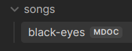
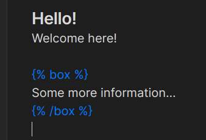

# Markdoc plugin for Obsidian

This plugin enables editing `.mdoc` files inside Obsidian and adds basic syntax highlighting for Markdoc tags.

## What does it do?

All markdoc files are accessible from the Obsidian file explorer as can be seen on the screenshot above. This means they can be edited like any other markdown file.

Very basic syntax highlighting for markdoc blocks is provided by this plugin.

## How to use

If you would like to manually install this plugin you need to download three different files:
- manifest.json
- main.js
- styles.css

Inside your vault locate the `.obsidian` directory and create a new subdirectory. Copy the three aforementioned files inside the newly created subdirectory. Lastly, reload the obsidian app and in settings under the "Community plugins" enable this plugin.

After finishing these steps the plugin should be installed.

